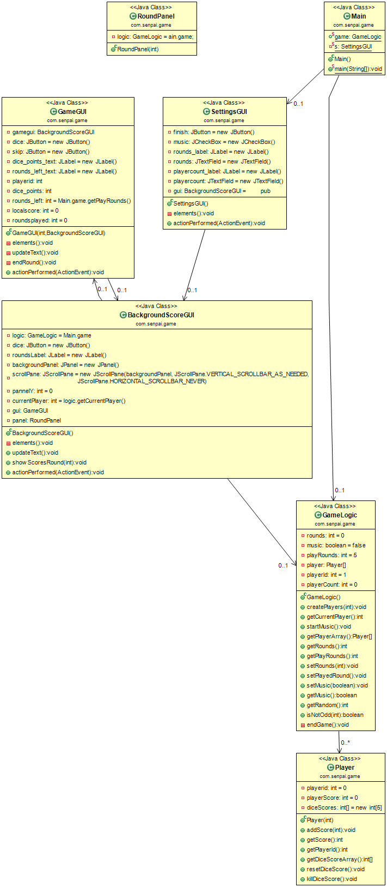

# M404 Projekt Arbeit

## Warum

Dieses Repo ist die Projektarbeit für das Modul 404.

## Was ist das

So nen Spiel was in Java entwickelt worden ist. Das Spiel ist in der JFrame geschrieben, dies Spiel wurde nach Spezifischer Vorgabe erstellt.

## Features

* UNENDLICH SPIELER (zumindest was der RAM so aushält)
* UNENDLICHE RUNDEN (wieder was der Ram so packt)
* High Action Gameplay(wenn Würfel High Action sind)
* Bester Soundtrack ever(24/7 Loop von einem Spiel Soundtrack Namens [Helltaker](https://www.youtube.com/watch?v=EnDXGQmCz3U))

## UML Diagramm:

