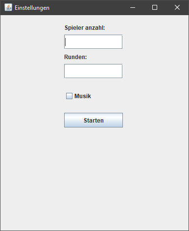
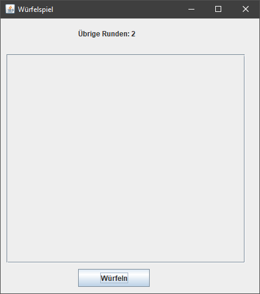
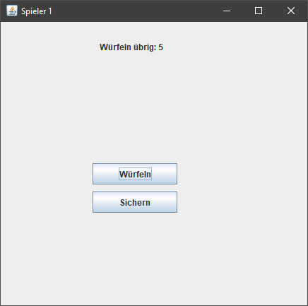
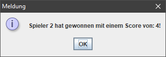

# M404 Projekt Arbeit

## Warum

Dieses Repo ist die Projektarbeit für das Modul 404.

## Was ist das

So nen Spiel was in Java entwickelt worden ist. Das Spiel ist in der JFrame geschrieben, dies Spiel wurde nach Spezifischer Vorgabe erstellt.

## Features

* UNENDLICH SPIELER (zumindest was der RAM so aushält)
* UNENDLICHE RUNDEN (wieder was der Ram so packt)
* High Action Gameplay(wenn Würfel High Action sind)
* Bester Soundtrack ever(24/7 Loop von einem Spiel Soundtrack Namens [Helltaker](https://www.youtube.com/watch?v=EnDXGQmCz3U))

## Funktion des Programms

Das Programm läuft zurzeit so ab. Wenn das Programm gestartet wird öffnet sich Folgendes „Konfigurationsfenster“ 

 
Hier kann wie beschrieben die Spieler Anzahl und die Runden Zahl bestimmt werden. Es muss mindestens 2 Spieler ausgewählt werden und mindestens 2 Runden gespielt werden. Auch als Option steht eine Checkbox für Musik aus. Die Musik ist wie in der Feature Liste aufgelistet von Spiel Helltaker.

 
Das ist das Hintergrund Fenster, da sind die jeweiligen Rundenscore aufzufinden, wenn auf den Knopf Würfeln geklickt wird kann jeweils der Jeweilige Spieler Würfeln

 
Im Fenstername ist immer zu sehen welcher Spieler dran ist. Dieser kann dann Würfeln oder seinen Gewürfelten Zahlen Speichern, wenn eine Ungerade Zahl gewürfelt wird, wird die Runde abgebrochen und der erzielte Score der Runde wird nicht hinzugezählt. 

 
Wenn die Spieler alle dran waren und alle Runden ausgespielt worden sind, wird am ende des Spieles ein Fenster Angezeigt mit den Informationen welcher Spieler gewonnen hat und wie der Score des gewinnen Spieler ist.

## UML Diagramm:

